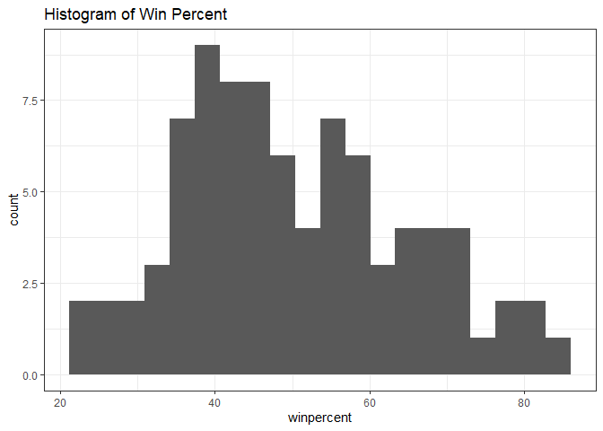
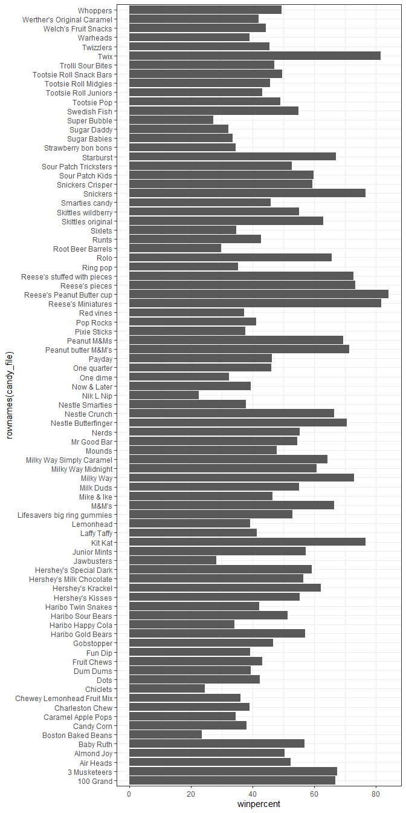
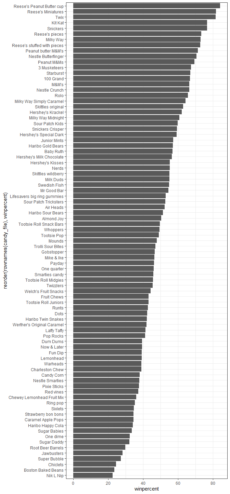
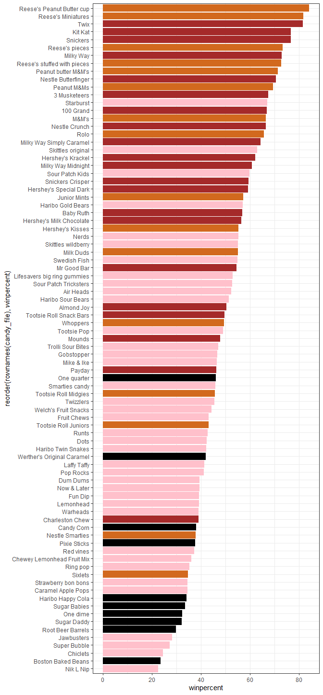
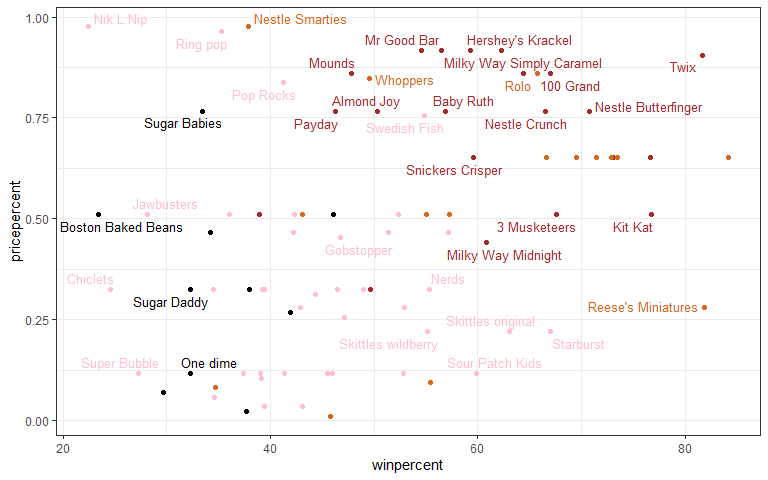
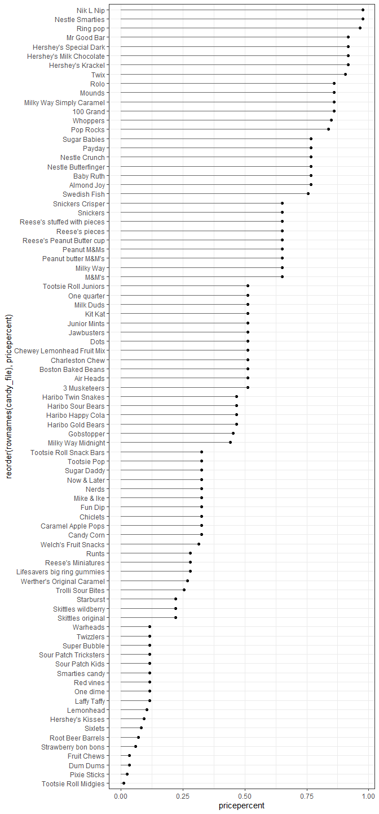
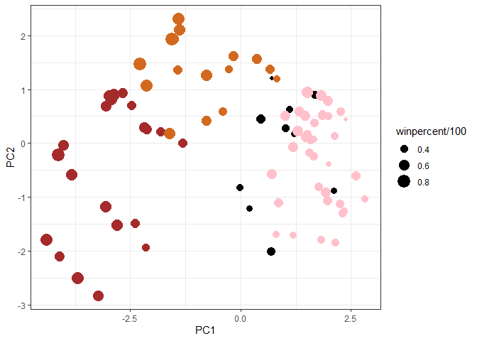
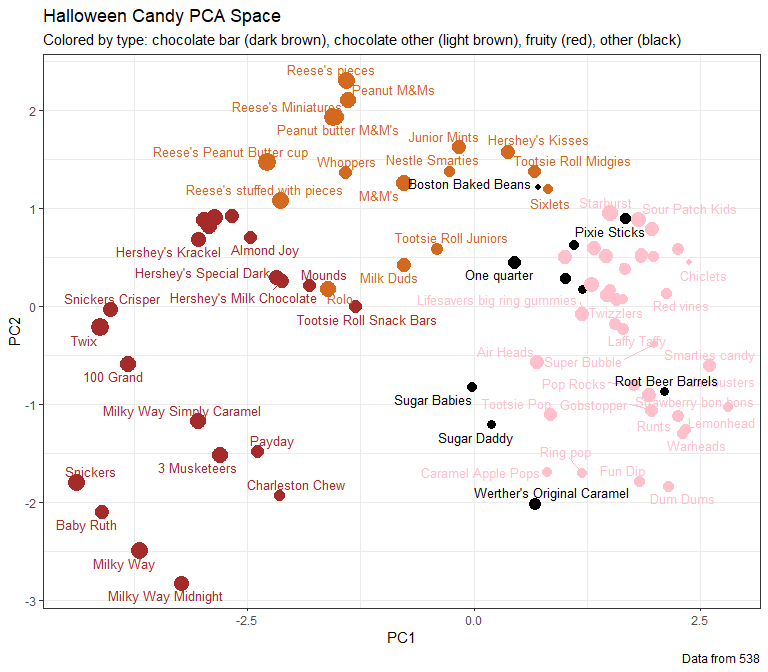
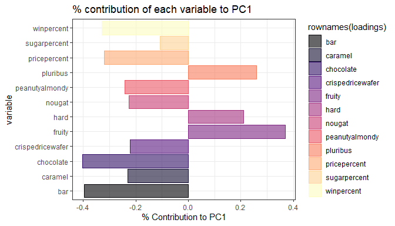

candy_proj
================

- <a href="#correlation-structure"
  id="toc-correlation-structure">Correlation Structure</a>
- <a href="#pca" id="toc-pca">PCA</a>
  - <a href="#interactive-plots-with-plotly"
    id="toc-interactive-plots-with-plotly">Interactive Plots with Plotly</a>
  - <a href="#variable-loadings-of-pca"
    id="toc-variable-loadings-of-pca">Variable Loadings of PCA</a>

``` r
library(dplyr)
```

    Warning: package 'dplyr' was built under R version 4.1.1


    Attaching package: 'dplyr'

    The following objects are masked from 'package:stats':

        filter, lag

    The following objects are masked from 'package:base':

        intersect, setdiff, setequal, union

``` r
library(ggplot2)
theme_set(theme_bw())
```

Import data

``` r
candy_file <- read.csv("candy-data.txt", sep = ",", row.names = 1)
```

> Q1. How many types of candy?

``` r
dim(candy_file)
```

    [1] 85 12

85

> Q2. Fruit candy \#?

``` r
table(candy_file$fruity)
```


     0  1 
    47 38 

38 are fruity.

> Q3. Whats the winpercent of your favorite candy?

``` r
candy_file["Milky Way", ]$winpercent
```

    [1] 73.09956

> Q4. Win percent for Kit Kat?

``` r
candy_file["Kit Kat", ]$winpercent
```

    [1] 76.7686

> Q5. Win percent for Tootsie Roll?

``` r
candy_file["Tootsie Roll Snack Bars", ]$winpercent
```

    [1] 49.6535

``` r
skimr::skim(candy_file)
```

|                                                  |            |
|:-------------------------------------------------|:-----------|
| Name                                             | candy_file |
| Number of rows                                   | 85         |
| Number of columns                                | 12         |
| \_\_\_\_\_\_\_\_\_\_\_\_\_\_\_\_\_\_\_\_\_\_\_   |            |
| Column type frequency:                           |            |
| numeric                                          | 12         |
| \_\_\_\_\_\_\_\_\_\_\_\_\_\_\_\_\_\_\_\_\_\_\_\_ |            |
| Group variables                                  | None       |

Data summary

**Variable type: numeric**

| skim_variable    | n_missing | complete_rate |  mean |    sd |    p0 |   p25 |   p50 |   p75 |  p100 | hist  |
|:-----------------|----------:|--------------:|------:|------:|------:|------:|------:|------:|------:|:------|
| chocolate        |         0 |             1 |  0.44 |  0.50 |  0.00 |  0.00 |  0.00 |  1.00 |  1.00 | ▇▁▁▁▆ |
| fruity           |         0 |             1 |  0.45 |  0.50 |  0.00 |  0.00 |  0.00 |  1.00 |  1.00 | ▇▁▁▁▆ |
| caramel          |         0 |             1 |  0.16 |  0.37 |  0.00 |  0.00 |  0.00 |  0.00 |  1.00 | ▇▁▁▁▂ |
| peanutyalmondy   |         0 |             1 |  0.16 |  0.37 |  0.00 |  0.00 |  0.00 |  0.00 |  1.00 | ▇▁▁▁▂ |
| nougat           |         0 |             1 |  0.08 |  0.28 |  0.00 |  0.00 |  0.00 |  0.00 |  1.00 | ▇▁▁▁▁ |
| crispedricewafer |         0 |             1 |  0.08 |  0.28 |  0.00 |  0.00 |  0.00 |  0.00 |  1.00 | ▇▁▁▁▁ |
| hard             |         0 |             1 |  0.18 |  0.38 |  0.00 |  0.00 |  0.00 |  0.00 |  1.00 | ▇▁▁▁▂ |
| bar              |         0 |             1 |  0.25 |  0.43 |  0.00 |  0.00 |  0.00 |  0.00 |  1.00 | ▇▁▁▁▂ |
| pluribus         |         0 |             1 |  0.52 |  0.50 |  0.00 |  0.00 |  1.00 |  1.00 |  1.00 | ▇▁▁▁▇ |
| sugarpercent     |         0 |             1 |  0.48 |  0.28 |  0.01 |  0.22 |  0.47 |  0.73 |  0.99 | ▇▇▇▇▆ |
| pricepercent     |         0 |             1 |  0.47 |  0.29 |  0.01 |  0.26 |  0.47 |  0.65 |  0.98 | ▇▇▇▇▆ |
| winpercent       |         0 |             1 | 50.32 | 14.71 | 22.45 | 39.14 | 47.83 | 59.86 | 84.18 | ▃▇▆▅▂ |

> Q6. Which variable is on a different scale than the others?

The mean (not 0-1).

> Q7. What do 0 and 1 represent for candy\$chocolate column?

Like TRUE/FALSE, whether the candy contains chocolate.

> Q8. Plot a histogram of winpercent values

``` r
ggplot(data = candy_file) + 
  aes(x = winpercent) + 
  geom_histogram(bins = 20) + 
  labs(title = "Histogram of Win Percent")
```



> Q9. Is win% distribution symmetrical?

No, skews lower than 50.

> Q10. Center of distribution?

Below 50.

> Q11. On average is chocolate candy ranked higher or lower than fruit
> candy?

``` r
win.choc <- candy_file[as.logical(candy_file$chocolate),"winpercent"]
win.fruity <- candy_file[as.logical(candy_file$fruity),"winpercent"]
```

``` r
mean(win.choc)
```

    [1] 60.92153

``` r
mean(win.fruity)
```

    [1] 44.11974

Chocolate on average has a higher win % than fruity candy.

> Q12. Is this difference statistically significant?

``` r
t.test(win.choc, win.fruity)
```


        Welch Two Sample t-test

    data:  win.choc and win.fruity
    t = 6.2582, df = 68.882, p-value = 2.871e-08
    alternative hypothesis: true difference in means is not equal to 0
    95 percent confidence interval:
     11.44563 22.15795
    sample estimates:
    mean of x mean of y 
     60.92153  44.11974 

Yes the difference is significant.

> Q13. What are the 5 least popular candies?

``` r
candy_file %>% arrange(winpercent) %>% head(5)
```

                       chocolate fruity caramel peanutyalmondy nougat
    Nik L Nip                  0      1       0              0      0
    Boston Baked Beans         0      0       0              1      0
    Chiclets                   0      1       0              0      0
    Super Bubble               0      1       0              0      0
    Jawbusters                 0      1       0              0      0
                       crispedricewafer hard bar pluribus sugarpercent pricepercent
    Nik L Nip                         0    0   0        1        0.197        0.976
    Boston Baked Beans                0    0   0        1        0.313        0.511
    Chiclets                          0    0   0        1        0.046        0.325
    Super Bubble                      0    0   0        0        0.162        0.116
    Jawbusters                        0    1   0        1        0.093        0.511
                       winpercent
    Nik L Nip            22.44534
    Boston Baked Beans   23.41782
    Chiclets             24.52499
    Super Bubble         27.30386
    Jawbusters           28.12744

> Q14. What are the top 5 candies?

``` r
# arrange numeric variable goes low to high, use - to reverse
candy_file %>% arrange(-winpercent) %>% head(5)
```

                              chocolate fruity caramel peanutyalmondy nougat
    Reese's Peanut Butter cup         1      0       0              1      0
    Reese's Miniatures                1      0       0              1      0
    Twix                              1      0       1              0      0
    Kit Kat                           1      0       0              0      0
    Snickers                          1      0       1              1      1
                              crispedricewafer hard bar pluribus sugarpercent
    Reese's Peanut Butter cup                0    0   0        0        0.720
    Reese's Miniatures                       0    0   0        0        0.034
    Twix                                     1    0   1        0        0.546
    Kit Kat                                  1    0   1        0        0.313
    Snickers                                 0    0   1        0        0.546
                              pricepercent winpercent
    Reese's Peanut Butter cup        0.651   84.18029
    Reese's Miniatures               0.279   81.86626
    Twix                             0.906   81.64291
    Kit Kat                          0.511   76.76860
    Snickers                         0.651   76.67378

> Q15. Barplot of candy ranking based on winpercent

``` r
ggplot(data = candy_file) +
  aes(winpercent, rownames(candy_file)) + 
  geom_col() 
```



``` r
ggplot(data = candy_file) +
  aes(winpercent, reorder(rownames(candy_file), winpercent)) + 
  geom_col() 
```



Add colors for candy type

``` r
my_cols=rep("black", nrow(candy_file))
my_cols[as.logical(candy_file$chocolate)] = "chocolate"
my_cols[as.logical(candy_file$bar)] = "brown"
my_cols[as.logical(candy_file$fruity)] = "pink"
```

``` r
ggplot(candy_file) + 
  aes(winpercent, reorder(rownames(candy_file),winpercent)) +
  geom_col(fill=my_cols) 
```



> Q17. What’s the worst ranked chocolate candy?

Sixlets.

> Q18. What’s the best ranked fruity candy?

Starburst

``` r
library(ggrepel)
```

    Warning: package 'ggrepel' was built under R version 4.1.1

``` r
ggplot(candy_file) +
  aes(winpercent, pricepercent, label=rownames(candy_file)) +
  geom_point(col=my_cols) + 
  geom_text_repel(col=my_cols, size=3.3, max.overlaps = 5)
```

    Warning: ggrepel: 49 unlabeled data points (too many overlaps). Consider
    increasing max.overlaps



> Q19. Which candy type is the highest ranked in terms of winpercent for
> the least money - i.e. offers the most bang for your buck?

Reese’s Miniatures

> Q20. What are the top 5 most expensive candy types in the dataset and
> of these which is the least popular?

``` r
candy_expensive <- candy_file %>% arrange(-pricepercent) %>% head(5)
candy_expensive
```

                             chocolate fruity caramel peanutyalmondy nougat
    Nik L Nip                        0      1       0              0      0
    Nestle Smarties                  1      0       0              0      0
    Ring pop                         0      1       0              0      0
    Hershey's Krackel                1      0       0              0      0
    Hershey's Milk Chocolate         1      0       0              0      0
                             crispedricewafer hard bar pluribus sugarpercent
    Nik L Nip                               0    0   0        1        0.197
    Nestle Smarties                         0    0   0        1        0.267
    Ring pop                                0    1   0        0        0.732
    Hershey's Krackel                       1    0   1        0        0.430
    Hershey's Milk Chocolate                0    0   1        0        0.430
                             pricepercent winpercent
    Nik L Nip                       0.976   22.44534
    Nestle Smarties                 0.976   37.88719
    Ring pop                        0.965   35.29076
    Hershey's Krackel               0.918   62.28448
    Hershey's Milk Chocolate        0.918   56.49050

``` r
candy_expensive[which.min(candy_expensive$winpercent),]
```

              chocolate fruity caramel peanutyalmondy nougat crispedricewafer hard
    Nik L Nip         0      1       0              0      0                0    0
              bar pluribus sugarpercent pricepercent winpercent
    Nik L Nip   0        1        0.197        0.976   22.44534

Nik L Nip are the least popular of the 5 most expensive candies.

> Q21. Make a barplot again with geom_col() this time using pricepercent
> and then improve this step by step, first ordering the x-axis by value
> and finally making a so called “dot chat” or “lollipop” chart by
> swapping geom_col() for geom_point() + geom_segment().

``` r
ggplot(data = candy_file) +
  aes(pricepercent, reorder(rownames(candy_file), pricepercent)) + 
  geom_point() +
  geom_segment(aes(yend = reorder(rownames(candy_file), pricepercent), xend = 0), col="gray40")
```



# Correlation Structure

``` r
library(corrplot)
```

    Warning: package 'corrplot' was built under R version 4.1.3

    corrplot 0.92 loaded

``` r
cij <- cor(candy_file)
corrplot(cij)
```


> Q22. Examining this plot what two variables are anti-correlated
> (i.e. have minus values)?

Most chocolate candies are not fruity/vice versa.

> Q23. Similarly, what two variables are most positively correlated?

Chocolate and win percent.

# PCA

``` r
pca <- prcomp(candy_file, scale = TRUE)
# If you dont scale, the winpercent variable (with a larger range) would dominate everything!
summary(pca)
```

    Importance of components:
                              PC1    PC2    PC3     PC4    PC5     PC6     PC7
    Standard deviation     2.0788 1.1378 1.1092 1.07533 0.9518 0.81923 0.81530
    Proportion of Variance 0.3601 0.1079 0.1025 0.09636 0.0755 0.05593 0.05539
    Cumulative Proportion  0.3601 0.4680 0.5705 0.66688 0.7424 0.79830 0.85369
                               PC8     PC9    PC10    PC11    PC12
    Standard deviation     0.74530 0.67824 0.62349 0.43974 0.39760
    Proportion of Variance 0.04629 0.03833 0.03239 0.01611 0.01317
    Cumulative Proportion  0.89998 0.93832 0.97071 0.98683 1.00000

``` r
plot(pca$x[, ])
```


``` r
plot(pca$x[,1:2], col=my_cols, pch=16)
```


Make a new dataframe for ggplot:

``` r
my_data <- cbind(candy_file, pca$x[,1:3])
```

Plot

``` r
p <- ggplot(my_data) + 
        aes(x=PC1, y=PC2, 
            size = winpercent/100,  
            text = rownames(my_data),
            label= rownames(my_data)) +
        geom_point(col=my_cols)
p
```



Make it better with ggrepel, labels, etc.

``` r
p + geom_text_repel(size=3.3, col=my_cols, max.overlaps = 7)  + 
  theme(legend.position = "none") +
  labs(title="Halloween Candy PCA Space",
       subtitle="Colored by type: chocolate bar (dark brown), chocolate other (light brown), fruity (red), other (black)",
       caption="Data from 538")
```

    Warning: ggrepel: 23 unlabeled data points (too many overlaps). Consider
    increasing max.overlaps



## Interactive Plots with Plotly

``` r
# library(plotly)
```

``` r
# ggplotly(p)
```

## Variable Loadings of PCA

``` r
par(mar=c(8,4,2,2))
library(viridis)
```

    Warning: package 'viridis' was built under R version 4.1.3

    Loading required package: viridisLite

``` r
barplot(pca$rotation[,1], las=2, ylab="PC1 Contribution")
```


``` r
loadings <- as.data.frame(pca$rotation)
  ggplot(data = loadings) + 
  aes(x = PC1, y = rownames(loadings)) +
    geom_col(aes(color = rownames(loadings), fill = rownames(loadings)), alpha = 0.6) + scale_fill_viridis(option = "magma", discrete = TRUE) + scale_color_viridis(option = "magma", discrete = TRUE) + labs(title = "% contribution of each variable to PC1") + ylab("variable") + xlab("% Contribution to PC1")
```



> Q24. What original variables are picked up strongly by PC1 in the
> positive direction? Do these make sense to you?

Pluribus, hard, and fruity are all positive. It makes sense that these
would correlate, many fruity candies are hard and small, coming in packs
of multiple (i.e. skittles, starburst, etc).

Extra:

``` r
#x <- rownames(candy_file)[1]
#title = "title of plot"
#plot + labs(title = paste(title, x))
# sep argument
```
