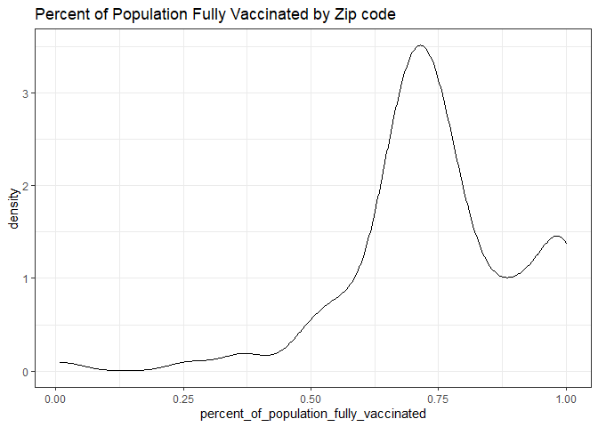
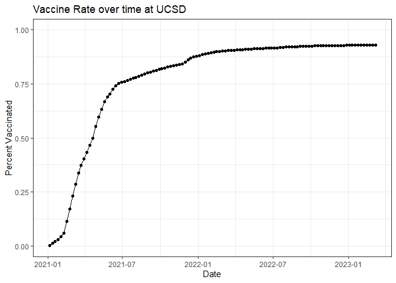
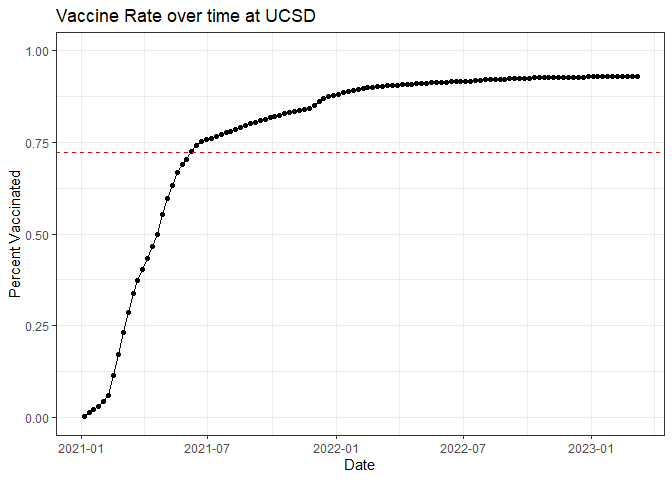
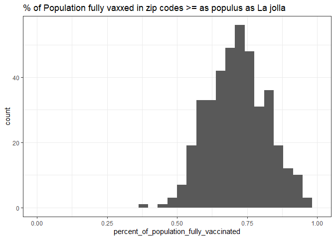
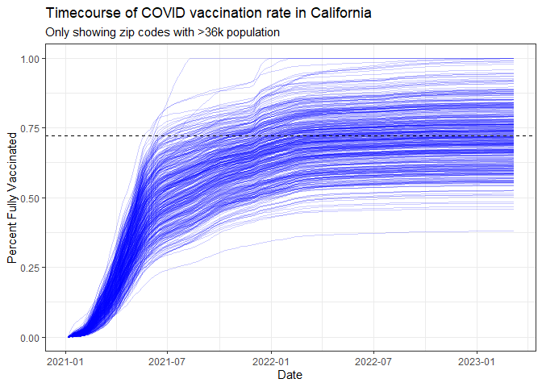

class17
================

- <a href="#import-and-presets" id="toc-import-and-presets">Import and
  Presets</a>
  - <a href="#data-input" id="toc-data-input">Data input</a>
    - <a href="#nice-summary-of-the-data-with-skimr"
      id="toc-nice-summary-of-the-data-with-skimr">Nice summary of the data
      with skimr</a>
  - <a href="#working-with-dates" id="toc-working-with-dates">Working with
    dates</a>
  - <a href="#working-with-zip-codes"
    id="toc-working-with-zip-codes">Working with ZIP codes</a>
- <a href="#maps" id="toc-maps">Maps</a>
- <a href="#looking-at-san-diego-county"
  id="toc-looking-at-san-diego-county">Looking at San Diego County</a>
- <a href="#focus-on-ucsdla-jolla" id="toc-focus-on-ucsdla-jolla">Focus on
  UCSD/La Jolla</a>

# Import and Presets

``` r
library(dplyr)
```

    Warning: package 'dplyr' was built under R version 4.1.1


    Attaching package: 'dplyr'

    The following objects are masked from 'package:stats':

        filter, lag

    The following objects are masked from 'package:base':

        intersect, setdiff, setequal, union

``` r
library(tidyr)
```

    Warning: package 'tidyr' was built under R version 4.1.1

``` r
library(ggplot2)
theme_set(theme_bw())
```

Import most recent vaccination data from
https://data.ca.gov/dataset/covid-19-vaccine-progress-dashboard-data-by-zip-code

CSV file is the second file, not the data dictionary file!

``` r
covidvax_info <- read.csv("covid19vaccinesbyzipcode_test.csv", sep = ",")
```

## Data input

``` r
head(covidvax_info)
```

      as_of_date zip_code_tabulation_area local_health_jurisdiction          county
    1 2021-01-05                    93609                    Fresno          Fresno
    2 2021-01-05                    94086               Santa Clara     Santa Clara
    3 2021-01-05                    94304               Santa Clara     Santa Clara
    4 2021-01-05                    94110             San Francisco   San Francisco
    5 2021-01-05                    93420           San Luis Obispo San Luis Obispo
    6 2021-01-05                    93454             Santa Barbara   Santa Barbara
      vaccine_equity_metric_quartile                 vem_source
    1                              1 Healthy Places Index Score
    2                              4 Healthy Places Index Score
    3                              4 Healthy Places Index Score
    4                              4 Healthy Places Index Score
    5                              3 Healthy Places Index Score
    6                              2 Healthy Places Index Score
      age12_plus_population age5_plus_population tot_population
    1                4396.3                 4839           5177
    2               42696.0                46412          50477
    3                3263.5                 3576           3852
    4               64350.7                68320          72380
    5               26694.9                29253          30740
    6               32043.4                36446          40432
      persons_fully_vaccinated persons_partially_vaccinated
    1                       NA                           NA
    2                       11                          640
    3                       NA                           NA
    4                       18                         1262
    5                       NA                           NA
    6                       NA                           NA
      percent_of_population_fully_vaccinated
    1                                     NA
    2                               0.000218
    3                                     NA
    4                               0.000249
    5                                     NA
    6                                     NA
      percent_of_population_partially_vaccinated
    1                                         NA
    2                                   0.012679
    3                                         NA
    4                                   0.017436
    5                                         NA
    6                                         NA
      percent_of_population_with_1_plus_dose booster_recip_count
    1                                     NA                  NA
    2                               0.012897                  NA
    3                                     NA                  NA
    4                               0.017685                  NA
    5                                     NA                  NA
    6                                     NA                  NA
      bivalent_dose_recip_count eligible_recipient_count
    1                        NA                        1
    2                        NA                       11
    3                        NA                        6
    4                        NA                       18
    5                        NA                        4
    6                        NA                        5
                                                                   redacted
    1 Information redacted in accordance with CA state privacy requirements
    2 Information redacted in accordance with CA state privacy requirements
    3 Information redacted in accordance with CA state privacy requirements
    4 Information redacted in accordance with CA state privacy requirements
    5 Information redacted in accordance with CA state privacy requirements
    6 Information redacted in accordance with CA state privacy requirements

For questions:

> Q3. First date in dataset?

``` r
first(covidvax_info$as_of_date)
```

    [1] "2021-01-05"

> Q4. Last date in dataset?

``` r
last(covidvax_info$as_of_date)
```

    [1] "2023-03-07"

BIG NOTE: the above assumes the data is sorted properly (the last line
being the last date) but what if it wasn’t? We can’t use `which.min`
because the dates are not numeric, they are strings!

### Nice summary of the data with skimr

``` r
skimr::skim(covidvax_info)
```

|                                                  |               |
|:-------------------------------------------------|:--------------|
| Name                                             | covidvax_info |
| Number of rows                                   | 201096        |
| Number of columns                                | 18            |
| \_\_\_\_\_\_\_\_\_\_\_\_\_\_\_\_\_\_\_\_\_\_\_   |               |
| Column type frequency:                           |               |
| character                                        | 5             |
| numeric                                          | 13            |
| \_\_\_\_\_\_\_\_\_\_\_\_\_\_\_\_\_\_\_\_\_\_\_\_ |               |
| Group variables                                  | None          |

Data summary

**Variable type: character**

| skim_variable             | n_missing | complete_rate | min | max | empty | n_unique | whitespace |
|:--------------------------|----------:|--------------:|----:|----:|------:|---------:|-----------:|
| as_of_date                |         0 |             1 |  10 |  10 |     0 |      114 |          0 |
| local_health_jurisdiction |         0 |             1 |   0 |  15 |   570 |       62 |          0 |
| county                    |         0 |             1 |   0 |  15 |   570 |       59 |          0 |
| vem_source                |         0 |             1 |  15 |  26 |     0 |        3 |          0 |
| redacted                  |         0 |             1 |   2 |  69 |     0 |        2 |          0 |

**Variable type: numeric**

| skim_variable                              | n_missing | complete_rate |     mean |       sd |    p0 |      p25 |      p50 |      p75 |     p100 | hist  |
|:-------------------------------------------|----------:|--------------:|---------:|---------:|------:|---------:|---------:|---------:|---------:|:------|
| zip_code_tabulation_area                   |         0 |          1.00 | 93665.11 |  1817.38 | 90001 | 92257.75 | 93658.50 | 95380.50 |  97635.0 | ▃▅▅▇▁ |
| vaccine_equity_metric_quartile             |      9918 |          0.95 |     2.44 |     1.11 |     1 |     1.00 |     2.00 |     3.00 |      4.0 | ▇▇▁▇▇ |
| age12_plus_population                      |         0 |          1.00 | 18895.04 | 18993.87 |     0 |  1346.95 | 13685.10 | 31756.12 |  88556.7 | ▇▃▂▁▁ |
| age5_plus_population                       |         0 |          1.00 | 20875.24 | 21105.97 |     0 |  1460.50 | 15364.00 | 34877.00 | 101902.0 | ▇▃▂▁▁ |
| tot_population                             |      9804 |          0.95 | 23372.77 | 22628.50 |    12 |  2126.00 | 18714.00 | 38168.00 | 111165.0 | ▇▅▂▁▁ |
| persons_fully_vaccinated                   |     16621 |          0.92 | 13990.39 | 15073.66 |    11 |   932.00 |  8589.00 | 23346.00 |  87575.0 | ▇▃▁▁▁ |
| persons_partially_vaccinated               |     16621 |          0.92 |  1702.31 |  2033.32 |    11 |   165.00 |  1197.00 |  2536.00 |  39973.0 | ▇▁▁▁▁ |
| percent_of_population_fully_vaccinated     |     20965 |          0.90 |     0.57 |     0.25 |     0 |     0.42 |     0.61 |     0.74 |      1.0 | ▂▃▆▇▃ |
| percent_of_population_partially_vaccinated |     20965 |          0.90 |     0.08 |     0.09 |     0 |     0.05 |     0.06 |     0.08 |      1.0 | ▇▁▁▁▁ |
| percent_of_population_with_1\_plus_dose    |     22009 |          0.89 |     0.63 |     0.24 |     0 |     0.49 |     0.67 |     0.81 |      1.0 | ▂▂▅▇▆ |
| booster_recip_count                        |     72997 |          0.64 |  5882.76 |  7219.00 |    11 |   300.00 |  2773.00 |  9510.00 |  59593.0 | ▇▂▁▁▁ |
| bivalent_dose_recip_count                  |    158776 |          0.21 |  2978.23 |  3633.03 |    11 |   193.00 |  1467.50 |  4730.25 |  27694.0 | ▇▂▁▁▁ |
| eligible_recipient_count                   |         0 |          1.00 | 12830.83 | 14928.64 |     0 |   507.00 |  6369.00 | 22014.00 |  87248.0 | ▇▃▁▁▁ |

``` r
# general note: if you are only using one function from a package and don't want to load with library() then use the :: sign above to save time 
```

> Q5. How many numeric columns are in this dataset?

13 (from SkimR data summary)

> Q6. Note that there are “missing values” in the dataset. How many NA
> values there in the persons_fully_vaccinated column?

``` r
sum(is.na(covidvax_info$persons_fully_vaccinated))
```

    [1] 16621

16621

> Q7. What percent of persons_fully_vaccinated values are missing (to 2
> significant figures)?

``` r
nmissing <- sum(is.na(covidvax_info$persons_fully_vaccinated))
# gives digits to return
round(nmissing/nrow(covidvax_info)*100, digits = 1)
```

    [1] 8.3

8.3%

> Q8. \[Optional\]: Why might this data be missing?

Check which zip codes, likely because of military people who get federal
medical data/don’t report.

## Working with dates

``` r
# from tidyverse package
library(lubridate)
```

    Warning: package 'lubridate' was built under R version 4.1.1


    Attaching package: 'lubridate'

    The following objects are masked from 'package:base':

        date, intersect, setdiff, union

``` r
today()
```

    [1] "2023-03-08"

Above print out looks like our data format, but the today() output is a
special date format not a character. The difference is we can do math on
it! How do we convert our dates to this format?

Using lubridate, we can specify the date format. In this example, format
is yyyy-mm-dd which can be specified with the function ymd().

``` r
covidvax_info$as_of_date <- ymd(covidvax_info$as_of_date)
```

> How many days have passed since the first day of vaccine records?

``` r
today() - covidvax_info$as_of_date[1]
```

    Time difference of 792 days

How many days since a date?

``` r
today() - ymd("1969-04-26")
```

    Time difference of 19674 days

> Q9. How many days have passed since the last update of the dataset?

``` r
today() - ymd(last(covidvax_info$as_of_date))
```

    Time difference of 1 days

> Q10. How many unique dates are in the dataset (i.e. how many different
> dates are detailed)?

``` r
# table groups all instances that are identical, spits out 1 row per unique instance, count the rows to get the number of unique dates
nrow(table(covidvax_info$as_of_date))
```

    [1] 114

``` r
# or 
length(unique(covidvax_info$as_of_date))
```

    [1] 114

``` r
# or the dplyr version
n_distinct(covidvax_info$as_of_date)
```

    [1] 114

## Working with ZIP codes

``` r
library(zipcodeR)
```

    Warning: package 'zipcodeR' was built under R version 4.1.3

The package zipcodeR pulls data from an online website, so it does
depend on the wifi but it’s lighter than other zip code packages.

Get lat/long for a zipcode:

``` r
geocode_zip('92037')
```

    # A tibble: 1 x 3
      zipcode   lat   lng
      <chr>   <dbl> <dbl>
    1 92037    32.8 -117.

Calculate distances:

``` r
zip_distance('92037','92109')
```

      zipcode_a zipcode_b distance
    1     92037     92109     2.33

``` r
lajolla <- reverse_zipcode(c('92037', "92109") )


york <- reverse_zipcode("17402")

head(york)
```

    # A tibble: 1 x 24
      zipcode zipcode_type major_city post_office_city common_city_list county state
      <chr>   <chr>        <chr>      <chr>                      <blob> <chr>  <chr>
    1 17402   Standard     York       York, PA               <raw 25 B> York ~ PA   
    # ... with 17 more variables: lat <dbl>, lng <dbl>, timezone <chr>,
    #   radius_in_miles <dbl>, area_code_list <blob>, population <int>,
    #   population_density <dbl>, land_area_in_sqmi <dbl>,
    #   water_area_in_sqmi <dbl>, housing_units <int>,
    #   occupied_housing_units <int>, median_home_value <int>,
    #   median_household_income <int>, bounds_west <dbl>, bounds_east <dbl>,
    #   bounds_north <dbl>, bounds_south <dbl>

Ratios of cost of living

``` r
lajolla$median_home_value/lajolla$median_household_income
```

    [1] 10.06371 11.12472

``` r
york$median_home_value/york$median_household_income
```

    [1] 3.101806

> What’s the best and worst ratio of income/home value in san diego?

First get the unique zip codes for san diego:

``` r
vax_sd <- covidvax_info %>% filter(county == "San Diego")
# head(vax_sd)

sd_zips <- unique(vax_sd$zip_code_tabulation_area)
```

Find the ratios, which zip code has the lowest ratio of income/median
home value?

``` r
# all reverse zip code stats for san diego zips
cost_living <- reverse_zipcode(sd_zips)

# find the minimum ratio of income/home price
which.min(cost_living$median_household_income/cost_living$median_home_value)
```

    [1] 77

Minimum:

``` r
cost_living[which.min(cost_living$median_household_income/cost_living$median_home_value),1:4]
```

    # A tibble: 1 x 4
      zipcode zipcode_type major_city post_office_city
      <chr>   <chr>        <chr>      <chr>           
    1 92109   Standard     San Diego  San Diego, CA   

``` r
ratios <- (cost_living$median_household_income/cost_living$median_home_value)

ratios[which.min(cost_living$median_household_income/cost_living$median_home_value)]
```

    [1] 0.08988986

The maximum/best ratio of income/home value:

``` r
cost_living[which.max(cost_living$median_household_income/cost_living$median_home_value),1:4]
```

    # A tibble: 1 x 4
      zipcode zipcode_type major_city post_office_city
      <chr>   <chr>        <chr>      <chr>           
    1 91963   Standard     Potrero    Potrero, CA     

``` r
# the ratio of income/home value
ratios[which.max(cost_living$median_household_income/cost_living$median_home_value)]
```

    [1] 0.493133

# Maps

``` r
# install first then library(leaflet)
```

# Looking at San Diego County

Filter for San Diego county and zip codes with a population \> 10000
(more fair comparisons).

``` r
sd.10k <- filter(covidvax_info, county == "San Diego" & age5_plus_population > 10000)
```

> Which San Diego zip code has the largest population over 12?

``` r
sd.10k_sorted <- sd.10k %>% arrange( desc(age12_plus_population) )
sd.10k_sorted[1,]
```

      as_of_date zip_code_tabulation_area local_health_jurisdiction    county
    1 2021-01-05                    92154                 San Diego San Diego
      vaccine_equity_metric_quartile                 vem_source
    1                              2 Healthy Places Index Score
      age12_plus_population age5_plus_population tot_population
    1               76365.2                82971          88979
      persons_fully_vaccinated persons_partially_vaccinated
    1                       16                         1400
      percent_of_population_fully_vaccinated
    1                                0.00018
      percent_of_population_partially_vaccinated
    1                                   0.015734
      percent_of_population_with_1_plus_dose booster_recip_count
    1                               0.015914                  NA
      bivalent_dose_recip_count eligible_recipient_count
    1                        NA                       16
                                                                   redacted
    1 Information redacted in accordance with CA state privacy requirements

> What is the overall average “Percent of Population Fully Vaccinated”
> value for all San Diego “County” as of “2023-02-28”?

``` r
sd_20230307 <- covidvax_info %>% filter(county == "San Diego" & as_of_date == "2023-03-07")

mean(sd_20230307$percent_of_population_fully_vaccinated, na.rm = TRUE)
```

    [1] 0.7402567

Plotting a histogram/density plot of the vaccination rates:

``` r
ggplot(data = sd_20230307) + 
  aes(x = percent_of_population_fully_vaccinated) +
  geom_density() +
  labs(title = "Percent of Population Fully Vaccinated by Zip code")
```

    Warning: Removed 8 rows containing non-finite values (stat_density).



# Focus on UCSD/La Jolla

``` r
sd <- covidvax_info %>% filter(county == "San Diego")
ucsd <- filter(sd, zip_code_tabulation_area=="92037")
ucsd[1,]$age5_plus_population
```

    [1] 36144

Ggplot to plot the time course of vaccination rate by date:

``` r
ggplot(data = ucsd) + 
  aes(x = as_of_date, y = percent_of_population_fully_vaccinated) +
  geom_point() + 
  geom_line(group = 1) +
  ylim(c(0,1)) +
  labs(title = "Vaccine Rate over time at UCSD", x = "Date", y="Percent Vaccinated")
```



Compare to all of California zip codes with similar population

``` r
# Subset to all CA areas with a population as large as 92037
vax.36 <- filter(covidvax_info, age5_plus_population > 36144 & as_of_date == "2023-03-07")
```

Mean % of fully vaxxed population

``` r
mean(vax.36$percent_of_population_fully_vaccinated)
```

    [1] 0.7214936

Last plot with the mean line:

``` r
ggplot(data = ucsd) + 
  aes(x = as_of_date, y = percent_of_population_fully_vaccinated) +
  geom_point() + 
  geom_line(group = 1) +
  ylim(c(0,1)) +
  labs(title = "Vaccine Rate over time at UCSD", x = "Date", y="Percent Vaccinated") + 
  geom_hline(yintercept = 0.7214936, color = "red", linetype = "dashed")
```



> Q17. What is the 6 number summary (Min, 1st Qu., Median, Mean, 3rd
> Qu., and Max) of the “Percent of Population Fully Vaccinated” values
> for ZIP code areas with a population as large as 92037 (La Jolla)
> as_of_date “2023-02-28”?

``` r
summary(vax.36$percent_of_population_fully_vaccinated)
```

       Min. 1st Qu.  Median    Mean 3rd Qu.    Max. 
     0.3805  0.6459  0.7183  0.7215  0.7908  1.0000 

> Q18. Make histogram with ggplot

``` r
ggplot(data = vax.36) +
  aes(x = percent_of_population_fully_vaccinated) +
  geom_histogram() + 
  xlim(c(0,1)) + 
  labs(title = "% of Population fully vaxxed in zip codes >= as populus as La jolla")
```

    `stat_bin()` using `bins = 30`. Pick better value with `binwidth`.

    Warning: Removed 2 rows containing missing values (geom_bar).



> Q19. Is the 92109 and 92040 ZIP code areas above or below the average
> value you calculated for all these above?

``` r
stats_92109 <- vax.36 %>% filter(zip_code_tabulation_area == "92109")
mean(stats_92109$percent_of_population_fully_vaccinated)
```

    [1] 0.694636

``` r
stats_92040 <- vax.36 %>% filter(zip_code_tabulation_area == "92040")
mean(stats_92040$percent_of_population_fully_vaccinated)
```

    [1] 0.550533

``` r
percent_pop_vaxxed <- c(mean(stats_92109$percent_of_population_fully_vaccinated)
, mean(vax.36$percent_of_population_fully_vaccinated), mean(stats_92040$percent_of_population_fully_vaccinated))

which.min(percent_pop_vaxxed)
```

    [1] 3

> Q20. Finally make a time course plot of vaccination progress for all
> areas in the full dataset with a age5_plus_population \> 36144.

``` r
timecourse <- covidvax_info %>% filter(age5_plus_population > 36144)

ggplot(data = timecourse) + 
  aes(x = as_of_date, y = percent_of_population_fully_vaccinated, group = zip_code_tabulation_area) + 
  geom_line(alpha = 0.2, color = "blue") + 
  labs(title = "Timecourse of COVID vaccination rate in California", subtitle = "Only showing zip codes with >36k population", x = "Date", y = "Percent Fully Vaccinated") +
  geom_hline(yintercept = 0.7214936, color = "black", linetype = "dashed")
```

    Warning: Removed 183 row(s) containing missing values (geom_path).



``` r
sessionInfo()
```

    R version 4.1.0 (2021-05-18)
    Platform: x86_64-w64-mingw32/x64 (64-bit)
    Running under: Windows 10 x64 (build 19044)

    Matrix products: default

    locale:
    [1] LC_COLLATE=English_United States.1252 
    [2] LC_CTYPE=English_United States.1252   
    [3] LC_MONETARY=English_United States.1252
    [4] LC_NUMERIC=C                          
    [5] LC_TIME=English_United States.1252    

    attached base packages:
    [1] stats     graphics  grDevices utils     datasets  methods   base     

    other attached packages:
    [1] zipcodeR_0.3.5  lubridate_1.8.0 ggplot2_3.3.5   tidyr_1.1.4    
    [5] dplyr_1.0.7    

    loaded via a namespace (and not attached):
     [1] Rcpp_1.0.10        lattice_0.20-44    class_7.3-19       assertthat_0.2.1  
     [5] digest_0.6.27      utf8_1.2.2         R6_2.5.1           repr_1.1.6        
     [9] RSQLite_2.2.9      evaluate_0.14      e1071_1.7-13       httr_1.4.2        
    [13] highr_0.9          pillar_1.6.5       rlang_1.0.6        curl_4.3.2        
    [17] uuid_1.0-3         rstudioapi_0.13    raster_3.6-20      blob_1.2.2        
    [21] rmarkdown_2.11     labeling_0.4.2     readr_2.1.1        stringr_1.4.0     
    [25] bit_4.0.4          munsell_0.5.0      proxy_0.4-27       compiler_4.1.0    
    [29] xfun_0.29          pkgconfig_2.0.3    tigris_2.0.1       base64enc_0.1-3   
    [33] htmltools_0.5.4    tidyselect_1.1.1   tibble_3.1.3       codetools_0.2-18  
    [37] fansi_0.5.0        crayon_1.4.2       tzdb_0.2.0         withr_2.5.0       
    [41] sf_1.0-9           tidycensus_1.3.2   rappdirs_0.3.3     grid_4.1.0        
    [45] jsonlite_1.7.3     gtable_0.3.0       lifecycle_1.0.1    DBI_1.1.2         
    [49] magrittr_2.0.1     units_0.8-1        scales_1.1.1       KernSmooth_2.23-20
    [53] cachem_1.0.6       cli_3.6.0          stringi_1.7.6      farver_2.1.0      
    [57] sp_1.6-0           skimr_2.1.5        xml2_1.3.3         ellipsis_0.3.2    
    [61] generics_0.1.1     vctrs_0.3.8        tools_4.1.0        bit64_4.0.5       
    [65] glue_1.4.2         purrr_0.3.4        hms_1.1.1          fastmap_1.1.0     
    [69] yaml_2.2.2         terra_1.7-18       colorspace_2.0-2   classInt_0.4-9    
    [73] rvest_1.0.2        memoise_2.0.1      knitr_1.37        
