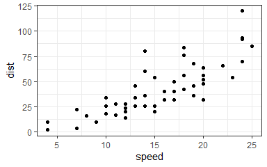

Class5: Data Vis
================

- <a href="#plotting-in-r" id="toc-plotting-in-r">Plotting in R</a>
- <a href="#gene-expression-data" id="toc-gene-expression-data">Gene
  Expression Data</a>
  - <a href="#inline-code-embedding" id="toc-inline-code-embedding">Inline
    code embedding</a>
- <a href="#gapminder-data" id="toc-gapminder-data">Gapminder data</a>
  - <a href="#plots" id="toc-plots">Plots</a>
  - <a href="#label-the-biggest-countries"
    id="toc-label-the-biggest-countries">Label the biggest countries</a>
- <a href="#combining-plots" id="toc-combining-plots">Combining Plots</a>

Code in ***bold*** is “\*\*\*” on either side of the word. You can add
options to executable code like this

    [1] 4

# Plotting in R

``` r
library(ggplot2)
library(tidyverse)
```

    -- Attaching packages --------------------------------------- tidyverse 1.3.1 --

    v tibble  3.1.3     v dplyr   1.0.7
    v tidyr   1.1.4     v stringr 1.4.0
    v readr   2.1.1     v forcats 0.5.1
    v purrr   0.3.4     

    -- Conflicts ------------------------------------------ tidyverse_conflicts() --
    x dplyr::filter() masks stats::filter()
    x dplyr::lag()    masks stats::lag()

``` r
theme_set(theme_bw())
```

``` r
head(cars, n = 5)
```

      speed dist
    1     4    2
    2     4   10
    3     7    4
    4     7   22
    5     8   16

``` r
# n is the number of rows to display
```

``` r
plot(cars)
```


Adding packages: first need to install install.packages() then load with
library()

``` r
ggplot(cars)
```


GGplot is more verbose than base R plot(), every ggplot needs at least 3
things:

- **data** = name of dataframe
- **aes** = how we want the data to map to the plot (within this we set
  the x, y, and anything we want to be dependent on a variable)
- **geom** = type of geometry to plot

``` r
ggplot(data = cars) + 
  aes(x = speed, y = dist) +
  geom_point()
```



``` r
ggplot(data = cars) + 
  aes(x = speed, y = dist) +
  geom_point() + geom_smooth(se = FALSE, method = "lm")
```

    `geom_smooth()` using formula 'y ~ x'


# Gene Expression Data

``` r
url <- "https://bioboot.github.io/bimm143_S20/class-material/up_down_expression.txt"
genes <- read.delim(url)
head(genes)
```

            Gene Condition1 Condition2      State
    1      A4GNT -3.6808610 -3.4401355 unchanging
    2       AAAS  4.5479580  4.3864126 unchanging
    3      AASDH  3.7190695  3.4787276 unchanging
    4       AATF  5.0784720  5.0151916 unchanging
    5       AATK  0.4711421  0.5598642 unchanging
    6 AB015752.4 -3.6808610 -3.5921390 unchanging

> Q. How many genes are in this dataset?

``` r
nrow(genes)
```

    [1] 5196

## Inline code embedding

There are 5196 genes in this dataset.

``` r
ncol(genes)
```

    [1] 4

``` r
colnames(genes)
```

    [1] "Gene"       "Condition1" "Condition2" "State"     

``` r
round(table(genes$State)/nrow(genes) * 100, 2 )
```


          down unchanging         up 
          1.39      96.17       2.44 

``` r
ggplot(data = genes) + 
  aes(x = Condition1, y = Condition2) + 
  geom_point()
```


``` r
gene_plot <- ggplot(data = genes) + 
  aes(x = Condition1, y = Condition2, color = State) + geom_point()
gene_plot
```


``` r
gene_plot + 
  scale_color_manual(values = c("blue", "grey", "red")) + 
  labs(title = "Gene Expression Changes Upon Drug Treatment") + xlab("Condition 1") + ylab("Condition 2")
```


# Gapminder data

``` r
library(gapminder)
```

    Warning: package 'gapminder' was built under R version 4.1.3

``` r
library(dplyr)
```

``` r
gapminder2007 <- gapminder %>% filter(year == 2007)
```

> Q2. How many countries?

``` r
length(unique(gapminder$country))
```

    [1] 142

There are 142 countries in the gapminder dataset.

``` r
range(gapminder$year)
```

    [1] 1952 2007

> Q3. Country with smallest population?

``` r
gapminder[which.min(gapminder$pop), 1]
```

    # A tibble: 1 x 1
      country              
      <fct>                
    1 Sao Tome and Principe

## Plots

``` r
ggplot(gapminder2007) + 
  aes(x = gdpPercap, y = lifeExp, color = continent, size = pop) +
  geom_point(alpha = 0.4)
```


``` r
ggplot(gapminder2007) + 
  aes(x = gdpPercap, y = lifeExp, color = pop) +
  geom_point(alpha = 0.8)
```


Fix the point size scaling to be accurate

``` r
ggplot(gapminder2007) + 
  aes(x = gdpPercap, y = lifeExp, size = pop) +
  geom_point(alpha = 0.6) + scale_size_area(max_size = 10)
```


Plot for 1957

``` r
gapminder1957 <- gapminder %>% filter(year == 1957)
```

``` r
ggplot(data = gapminder1957) + 
  aes(x = gdpPercap, y = lifeExp, color = continent, size = pop) + 
  geom_point(alpha = 0.7) + 
  scale_size_area(max_size = 11)
```


Plot for both years:

``` r
head(gapminder)
```

    # A tibble: 6 x 6
      country     continent  year lifeExp      pop gdpPercap
      <fct>       <fct>     <int>   <dbl>    <int>     <dbl>
    1 Afghanistan Asia       1952    28.8  8425333      779.
    2 Afghanistan Asia       1957    30.3  9240934      821.
    3 Afghanistan Asia       1962    32.0 10267083      853.
    4 Afghanistan Asia       1967    34.0 11537966      836.
    5 Afghanistan Asia       1972    36.1 13079460      740.
    6 Afghanistan Asia       1977    38.4 14880372      786.

``` r
gapminder_1957_2007 <- gapminder %>% filter(year %in% c(1957, 2007))
```

``` r
ggplot(data = gapminder_1957_2007) + 
  aes(x = gdpPercap, y = lifeExp, color = continent, size = pop) + 
  geom_point(alpha = 0.7) + 
  scale_size_area(max_size = 11) + facet_wrap(~ year) + 
  labs(title = "Life Expectancy vs GDP per Capita") + 
  xlab("GDP Per Capita") + 
  ylab("Life Expectancy") 
```


## Label the biggest countries

``` r
gapminder_labels <- gapminder_1957_2007 %>% dplyr::arrange(desc(pop)) %>% .[1:6, ]

ggplot(data = gapminder_1957_2007) + 
  aes(x = gdpPercap, y = lifeExp, color = continent, size = pop) + 
  geom_point(alpha = 0.5) + 
  scale_size_area(max_size = 11) + facet_wrap(~ year) + 
  labs(title = "Life Expectancy vs GDP per Cap") + 
  xlab("GDP Per Capita") + 
  ylab("Life Expectancy") + geom_text(data = gapminder_labels , aes(label = country), size = 3, nudge_x = 10000, nudge_y = -2.0)
```


# Combining Plots

``` r
library(patchwork)
```

    Warning: package 'patchwork' was built under R version 4.1.1

``` r
p1 <- ggplot(mtcars) + geom_point(aes(mpg, disp))
p2 <- ggplot(mtcars) + geom_boxplot(aes(gear, disp, group = gear))
p3 <- ggplot(mtcars) + geom_smooth(aes(disp, qsec))
p4 <- ggplot(mtcars) + geom_bar(aes(carb))
```

Combining the basic plots

``` r
(p1 | p2 | p3 ) / p4
```

    `geom_smooth()` using method = 'loess' and formula 'y ~ x'


